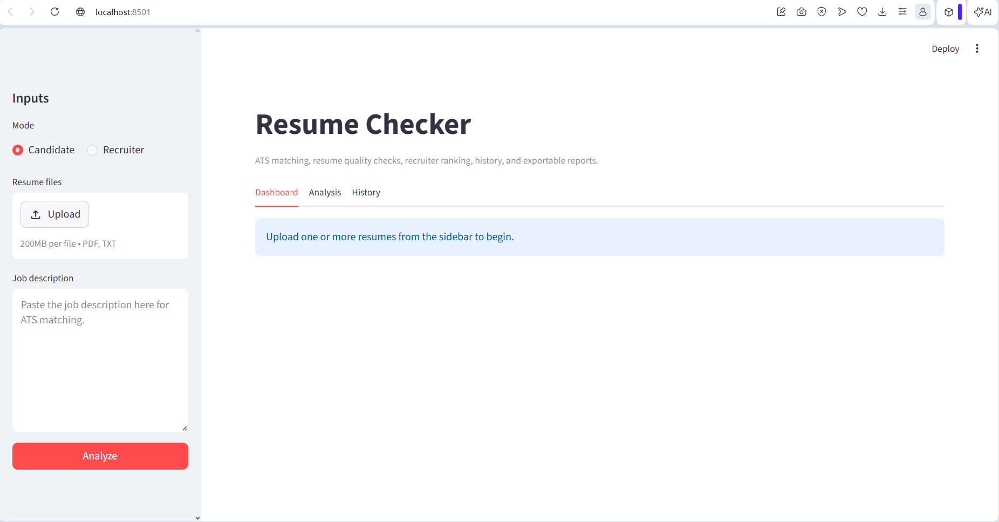
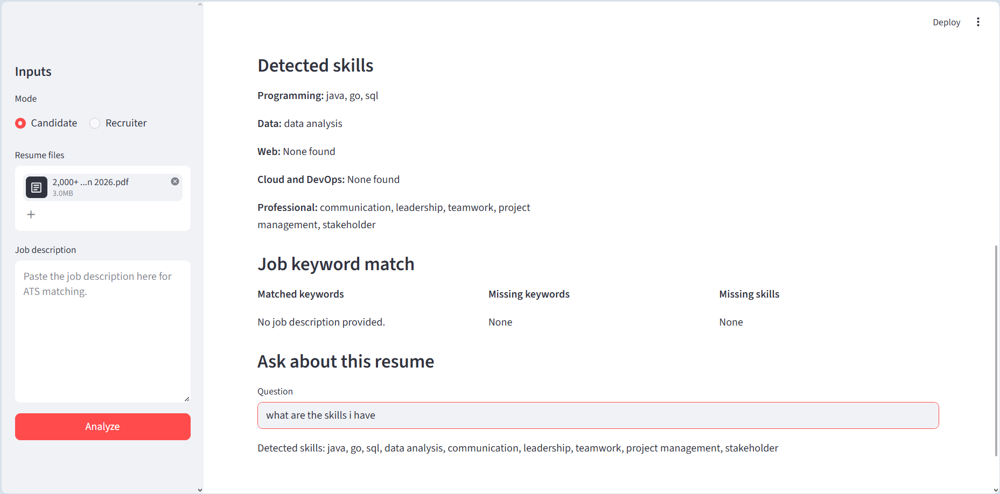
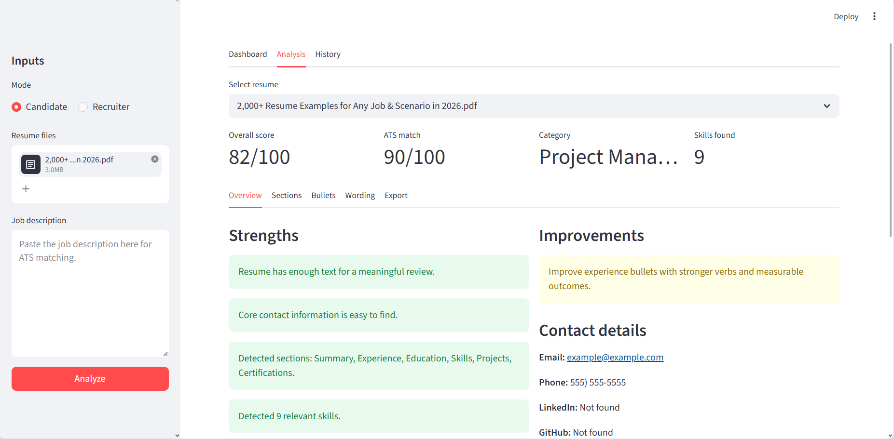
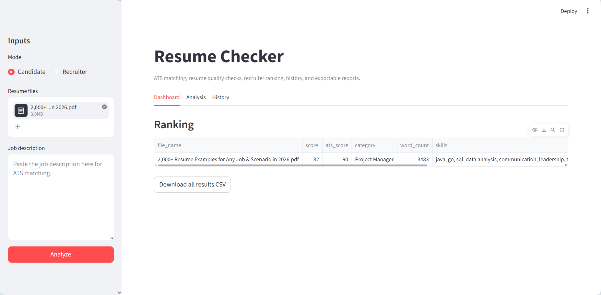
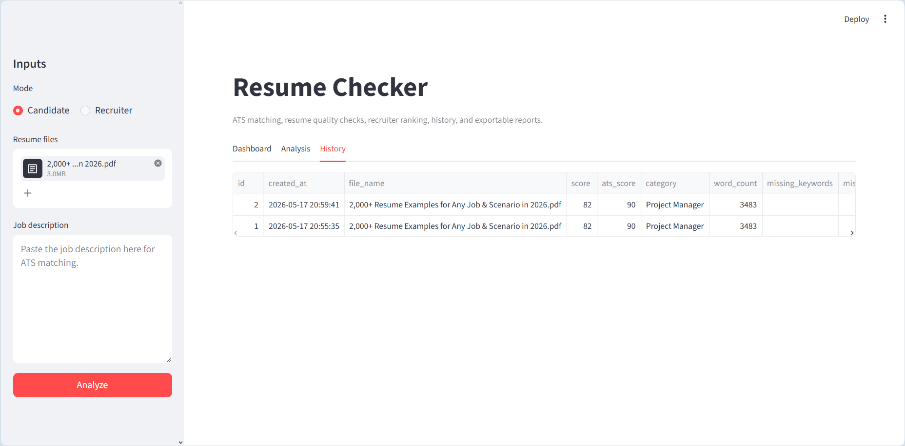

# Resume Checker

A local Streamlit app for candidate resume review and recruiter-style resume ranking.

## Features

- Upload one or many PDF/TXT resumes.
- Score each resume with an overall quality score and ATS match score.
- Compare resumes against a pasted job description.
- Detect contact details, resume sections, skills, missing keywords, and missing job skills.
- Predict the closest job category.
- Review experience bullets for action verbs, metrics, length, and weak wording.
- Show grammar/wording suggestions using local rule-based checks.
- Rank multiple resumes for recruiter/admin workflows.
- Store analysis history in a local SQLite database.
- Export CSV, printable HTML, and optional PDF reports.

## Setup

Create a fresh virtual environment. The old `venv` folder may not work on another machine because virtual environments store machine-specific Python paths.

```powershell
python -m venv .venv
.\.venv\Scripts\Activate.ps1
python -m pip install --upgrade pip
python -m pip install -r requirements.txt
```

## Run

```powershell
streamlit run resume_checker.py
```

Then open the local URL shown by Streamlit.

## Optional PDF Export

Direct PDF export uses `reportlab`. If it is not installed, the app still provides a printable HTML report that can be saved as PDF from the browser.

## Privacy

The app is rule-based and runs locally. It does not send resumes to an external API.

## Screenshots

### Home Page


### question 1


### question 2


### analysis


### Dashboard


### History

